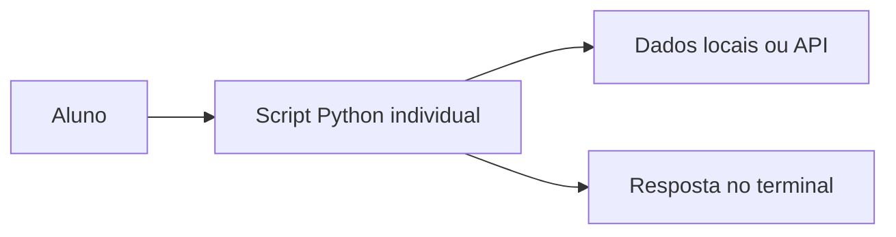

# Estrutura — Atividade5-EdN

```mermaid
flowchart LR
  Aluno --> Script["Script Python individual"]
  Script --> Entrada["Dados locais ou API"]
  Script --> Resultado["Resposta no terminal"]
```

Scripts existentes: 1/gorjeta.py, 2/palindromo.py, 3/desconto.py, 4/idade_em_dias.py. Diagrama de aprendizagem, não arquitetura de backend integrado.
